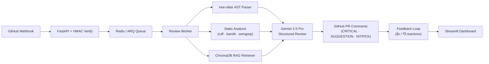

<](https://github.com/Sparky0408/codereview-agent/actions)
[](LICENSE)
[](https://python.org)
[](https://ai.google.dev/)
[](Dockerfile)

**Open-source, self-hostable AI code review bot that posts severity-tiered inline comments on GitHub pull requests — powered by AST parsing, RAG context retrieval, static analysis fusion, and Gemini.**

</div>

---

## Demo

<p align="center">
  
</p>

## Why CodeReview Agent?

Most AI review tools are black boxes that treat code as flat text. CodeReview Agent is different:

- **AST-aware** — Parses diffs with tree-sitter, so the LLM sees function boundaries, not raw lines.
- **RAG-augmented** — Retrieves related code from the repo via ChromaDB embeddings, giving the LLM project-wide context instead of reviewing files in isolation.
- **Static analysis fusion** — Runs ruff, bandit, ESLint, and semgrep _before_ the LLM, feeding real linter findings as ground truth to eliminate mechanical noise.
- **Self-hostable & transparent** — Your code stays on your infra. Every comment is traceable to a severity level and feedback loop.

| Feature | CodeReview Agent | CodeRabbit | GitHub Copilot | PR-Agent |
|---------|:---:|:---:|:---:|:---:|
| Self-hostable | ✅ | ❌ | ❌ | ✅ |
| AST-aware diff parsing | ✅ | ❌ | ❌ | Partial |
| RAG context retrieval | ✅ | ❌ | ❌ | ❌ |
| Static analysis fusion | ✅ | ❌ | ❌ | ❌ |
| Feedback learning loop | ✅ | ✅ | ❌ | ❌ |
| Per-repo configuration | ✅ | ✅ | ❌ | ✅ |
| Open source | ✅ | ❌ | ❌ | ✅ |

## Quick Start

**Prerequisites:** Docker & Docker Compose, a [GitHub App](https://docs.github.com/en/apps/creating-github-apps), and a [Gemini API key](https://ai.google.dev/).

```bash
# 1. Clone
git clone https://github.com/Sparky0408/codereview-agent.git
cd codereview-agent

# 2. Configure
cp .env.example .env
# Edit .env — set GITHUB_APP_ID, GITHUB_WEBHOOK_SECRET, GEMINI_API_KEY
# Place your GitHub App PEM at secrets/codereview-agent.pem

# 3. Launch (5 services: app, worker, postgres, redis, dashboard)
docker compose up -d

# 4. Install the GitHub App on a test repo, open a PR, watch the bot review.
```

The dashboard is available at [http://localhost:8501](http://localhost:8501) once running.

## Architecture



> **Deep dive →** [docs/architecture.md](docs/architecture.md) — component design, sequence diagrams, data flow, scaling notes.

## Evaluation

We run the evaluation harness against real open-source PRs. Numbers are honest — this is an early-stage project and matching human reviewers is genuinely hard.

| Repository | PRs | Precision | Recall | F1 | Model |
|------------|-----|-----------|--------|----|-------|
| `tiangolo/sqlmodel` | 10 | 0.0% | 0.0% | 0.0% | gemini-2.5-flash |
| `encode/starlette` | 10 | 0.0% | 0.0% | 0.0% | gemini-2.5-flash |

> **Caveat:** Current metrics reflect the strict matching criteria — a bot comment must land on the _exact same line_ as a human comment to count as a true positive. Many bot comments are valid findings that humans simply didn't flag. Improving the matching heuristic and using Gemini 2.5 Pro (vs Flash) are active areas of work.

Full reports: [`eval_reports/`](eval_reports/)

## Configuration

Drop a `.codereview.yml` in your repository root to customize the bot:

```yaml
enabled: true
languages: [python, javascript]
ignore_paths:
  - "docs/**"
  - "*.md"
review_rules:
  max_function_lines: 50
  max_cyclomatic_complexity: 10
  max_function_args: 5
  severity_threshold: SUGGESTION      # only post SUGGESTION and above
  max_comments_per_file: 10
  max_total_comments: 25
  banned_patterns:
    - "TODO"
    - "HACK"
```

> **Full reference →** [docs/configuration.md](docs/configuration.md)

## Tech Stack

| Layer | Technology |
|-------|-----------|
| Language | Python 3.12 |
| Web framework | FastAPI + uvicorn |
| LLM | Gemini 2.5 Pro (review) / Flash (triage) |
| AST parsing | tree-sitter (Python, JS, TS) |
| Static analysis | ruff, bandit, semgrep, ESLint |
| RAG | ChromaDB + sentence-transformers (all-MiniLM-L6-v2) |
| Queue | Redis + ARQ |
| Database | PostgreSQL 16 + SQLAlchemy 2.0 async |
| Dashboard | Streamlit + Plotly |
| Packaging | uv (hatchling backend) |
| Containers | Docker + Docker Compose |

## Contributing

We welcome contributions! See [CONTRIBUTING.md](CONTRIBUTING.md) for dev setup, testing, branch conventions, and PR guidelines.

## Security

For vulnerability reports, see [SECURITY.md](SECURITY.md).

## License

[MIT](LICENSE) — use it, fork it, ship it.

## Author

**Ruturaj** — [GitHub](https://github.com/Sparky0408)

---

<div align="center">
  <sub>Built with ☕ and weekend sprints.</sub>
</div>
]]>
