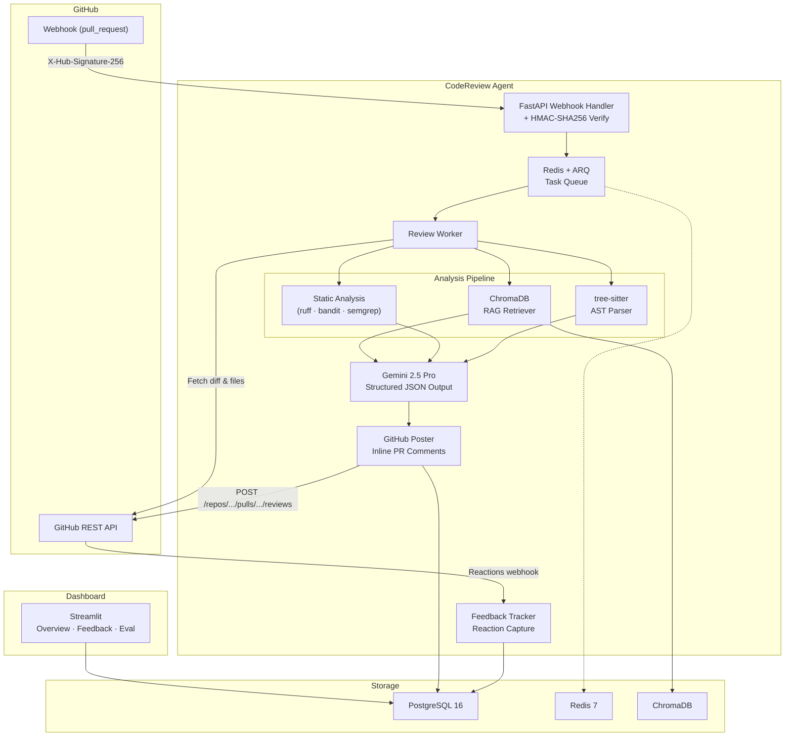
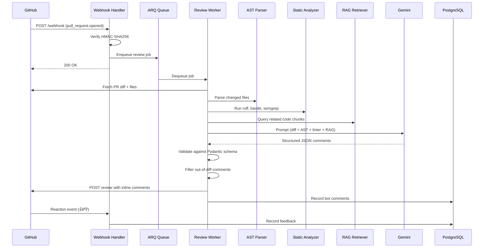
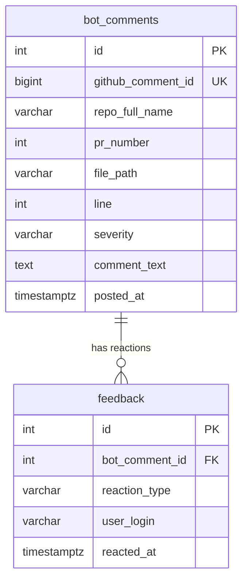

<![CDATA[# Architecture

This document describes the internal architecture of CodeReview Agent — a self-hostable GitHub bot that reviews pull requests using LLM-generated, severity-tiered inline comments.

## System Overview

## Component Details

### 1. Webhook Handler (`app/webhook.py`)

Receives `pull_request` events (actions: `opened`, `synchronize`) from GitHub.

- **HMAC-SHA256 signature verification** is mandatory — the raw request body is verified against `X-Hub-Signature-256` using the configured webhook secret.
- Valid events are dispatched to the ARQ task queue for async processing.
- Invalid signatures return `403`; non-PR events return `200` with a skip message.

**Design decision: FastAPI over Flask** — FastAPI provides native async support, Pydantic validation, and OpenAPI docs out of the box. Since every I/O operation in the pipeline is async, FastAPI is the natural fit.

### 2. Task Queue (`app/workers/`)

- **ARQ** (async Redis queue) handles job dispatch and retry.
- Each PR review is a single job containing `repo_full_name`, `pr_number`, and `installation_id`.
- The worker pool is decoupled from the web process, so webhook latency stays under 500ms.

**Design decision: ARQ over Celery** — ARQ is async-native (built on `asyncio`), lightweight, and avoids Celery's complex broker configuration. For the expected throughput (hundreds of PRs/day), ARQ is sufficient.

### 3. AST Parser (`app/services/ast_parser.py`)

- Parses changed files using **tree-sitter** with language-specific grammars (Python, JavaScript, TypeScript).
- Extracts function-level metadata: name, line range, argument count, line count.
- Feeds structured AST context into the LLM prompt so it understands function boundaries, not raw diff hunks.

**Design decision: tree-sitter over Python `ast`** — tree-sitter handles multiple languages with a consistent API and operates on potentially malformed code (which is common in diffs). The stdlib `ast` module is Python-only and fails on syntax errors.

### 4. Static Analysis (`app/services/static_analyzer.py`)

Runs pre-LLM static analysis tools on changed files:

| Tool | Scope | Purpose |
|------|-------|---------|
| ruff | Python | Fast linting (pyflakes + pycodestyle + more) |
| bandit | Python | Security vulnerability detection |
| semgrep | Multi-lang | Pattern-based security and correctness rules |
| ESLint | JS/TS | JavaScript/TypeScript linting |

- Findings are formatted and injected into the Gemini prompt as **ground truth**.
- This reduces mechanical noise — the LLM is instructed not to re-flag what linters already catch, and instead focuses on semantic, architectural, and logic issues.
- Tool failures (missing binary, timeout) are gracefully skipped — the review continues without that tool's input.

### 5. RAG Retriever (`app/services/context_retriever.py`)

- Queries **ChromaDB** for code chunks semantically similar to the changed files.
- Embeddings are generated using `sentence-transformers/all-MiniLM-L6-v2`.
- A strict **12k token budget** limits context window usage, with intelligent redistribution across files.
- Same-file chunks are excluded (the LLM already sees the diff).

**Design decision: ChromaDB over Pinecone/Weaviate** — ChromaDB runs locally with zero infrastructure, stores embeddings on disk, and is sufficient for single-repo indexing. No external API calls, no vendor lock-in.

### 6. Repository Indexer (`app/services/repo_indexer.py`)

- On first review, fetches the full repository file tree via the GitHub API.
- Uses AST-based chunking (function-level segments) for meaningful embeddings.
- Stores chunks in ChromaDB with incremental updates on subsequent PRs.
- Index is keyed by `repo_full_name` for multi-repo support.

### 7. Reviewer (`app/services/reviewer.py`)

- Constructs the Gemini prompt from: diff, AST metadata, static analysis findings, and RAG context chunks.
- Uses **structured JSON output** with a Pydantic schema to enforce valid responses.
- If Gemini returns malformed JSON, retries once with a strict-JSON reminder, then gives up gracefully.
- **Token budget cap: 30k tokens** total (diff + AST + linter + RAG). Lowest-similarity RAG chunks are dropped first.

**Design decision: Gemini 2.5 Pro over GPT-4/Claude** — Gemini 2.5 Pro offers strong code understanding with native structured output support. Flash is used for fast triage of trivial PRs.

### 8. GitHub Poster (`app/services/github_poster.py`)

- Posts review comments via the GitHub Pull Request Reviews API.
- Comments are severity-tiered: `CRITICAL` (red), `SUGGESTION` (yellow), `NITPICK` (blue).
- Out-of-diff comments (referencing lines not in the PR's changed hunks) are filtered before posting.
- Uses GitHub App installation tokens (JWT → installation token flow) for authentication.

### 9. Feedback Tracker (`app/services/feedback_tracker.py`)

- Captures 👍 / 👎 reactions on bot comments via the `issue_comment` / `pull_request_review_comment` reaction webhook.
- Records reactions in PostgreSQL, linked to the original bot comment.
- Calculates acceptance rates per severity, per repo, and over time.
- Powers the dashboard and future auto-muting of low-quality comment patterns.

### 10. Per-Repo Configuration (`app/services/config_loader.py`)

- Fetches `.codereview.yml` from the repository's default branch.
- Validates against a Pydantic schema (`RepoConfig`).
- Supports path filtering, language selection, severity thresholds, and custom review rules.
- Falls back to sensible defaults when no config file is found.

## Data Flow

## Database Schema

## Scaling Considerations

| Bottleneck | Threshold | Mitigation |
|-----------|-----------|------------|
| ARQ worker throughput | ~100 PRs/hr per worker | Horizontal scaling — add more worker replicas |
| Gemini API rate limits | Varies by tier | Request queuing with exponential backoff; Gemini 2.5 Flash for triage |
| ChromaDB single-node | ~1M vectors | Shard by repo; migrate to distributed vector DB if needed |
| PostgreSQL connections | Default pool (5-20) | PgBouncer or increase `max_connections`; read replicas for dashboard |
| GitHub API rate limits | 5000 req/hr per installation | Cache file contents; batch API calls; use conditional requests |

**At 1000 PRs/day** (a realistic target for a mid-size org), the main bottleneck is Gemini API throughput. The recommended setup is 3-5 ARQ workers with a rate-limited Gemini client and a dedicated PostgreSQL read replica for the dashboard.
]]>
